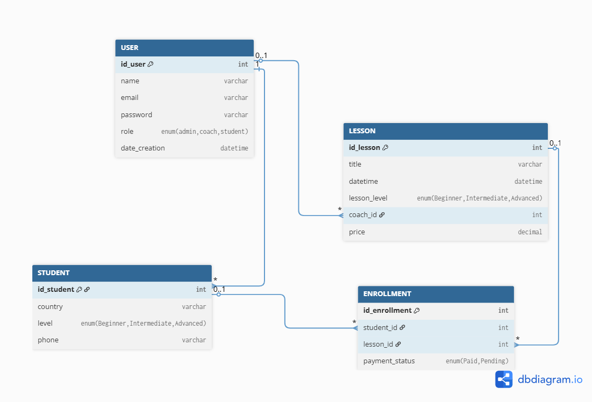
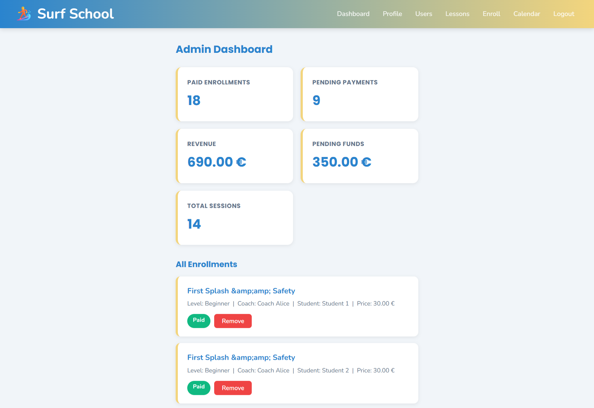
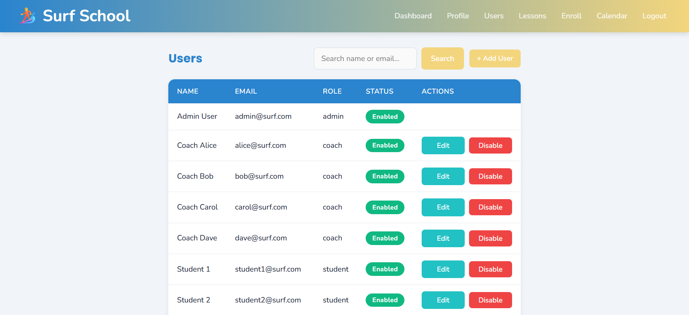
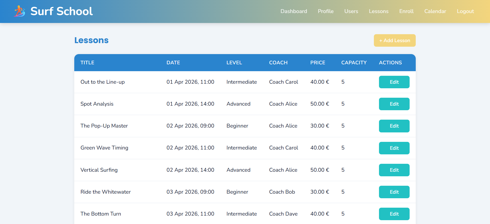
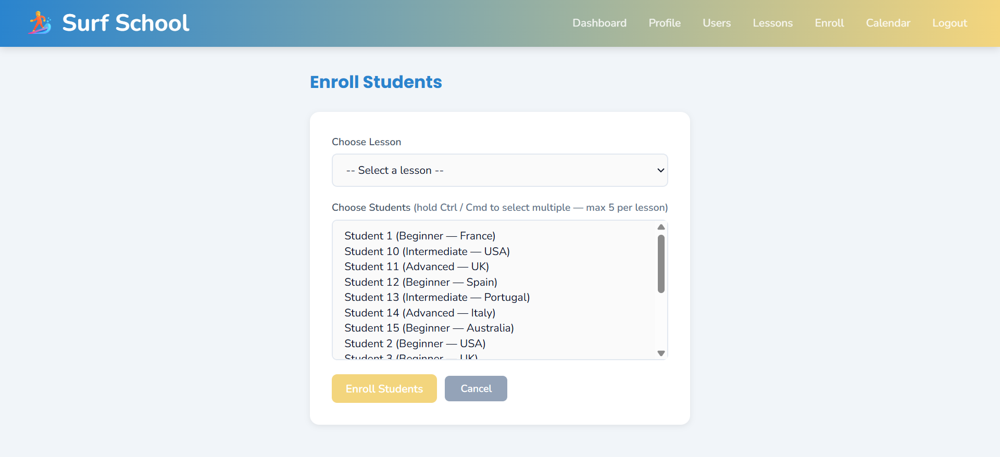
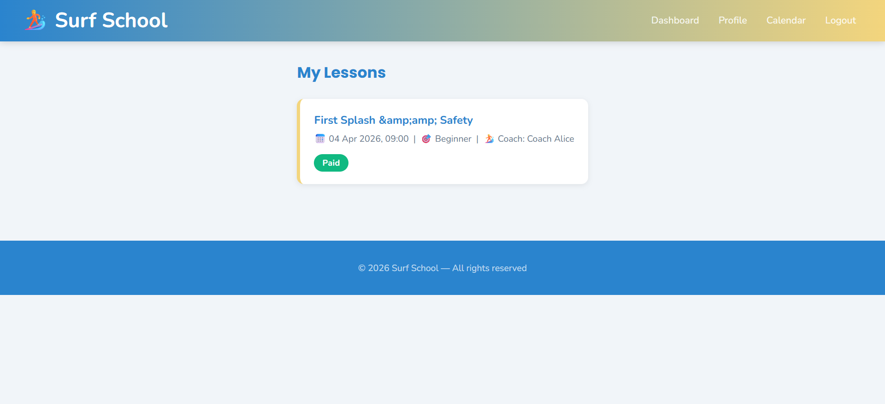

# SurfSchool Manager

## Overview

SurfSchool Manager is a web-based platform for managing surf lessons and student enrollments at Taghazout Surf Expo.  
It provides role-based access with **Admin** and **Surfer** roles. Admins can manage users, students, lessons, and payments, while surfers can view their own lessons and payment status.

The system follows **MVC architecture** with **OOP** principles, a normalized **MySQL database**, and secure authentication using **PHP sessions** and **hashed passwords**.

## Features

### Admin (Manager) Access
- User management: create, edit, enable/disable users instead of delete.
- Student management: add, edit, track skill levels (Beginner, Intermediate, Advanced).
- Lesson management: create, update, assign lessons to students.
- Enrollment management: track student registrations and payment status.
- Dashboard with statistics:
  - Total students, lessons, and enrollment status.
  - Average class size per session.

### Surfer (Client) Access
- Self-registration with name, country, and skill level.
- View personal lesson schedule.
- Check payment status ("Paid" or "Pending").

## Installation

### Prerequisites
- Git
- XAMPP (Apache + MySQL)

### Steps

1. **Start XAMPP**
   - Open XAMPP Control Panel and start Apache and MySQL.

2. **Clone the repository**
```bash
cd C:\xampp\htdocs
git clone https://github.com/BEN-ESSAHRAOUI-Yassine/SurfSchool_Manager.git
```
3. **Import the database**
-   Open phpMyAdmin.
-   Create a database surf_school.
-   Import the schema.sql file from the config folder.
4. **Configure the project**

Open config/database.php and set your database credentials:
```bash
$host = "localhost";
$dbname = "surfschool_db";
$username = "root";
$password = "";
```
5. **Access the project**

Open your browser and go to:
```bash
http://localhost/SurfSchool-Manager/public/
```
---

## Technologies Used

- PHP 8+ (Core PHP with PDO for database access)
- MySQL (Relational database with foreign keys)
- HTML5, CSS3 (Responsive design)
- XAMPP (Apache server & MySQL)
- Git (Version control)
- PHP Sessions (Authentication)
- Password Hashing (password_hash / password_verify)
- MVC Architecture & OOP (Encapsulation with private/public properties)
- Role-Based Access Control (Admin / Surfer)
---

## Directory Structure

```
└── 📁app
    └── 📁controllers
        ├── AdminController.php
        ├── AuthController.php
        ├── CalendarController.php
        ├── DashboardController.php
        ├── EnrollmentController.php
        ├── LessonController.php
        ├── ProfileController.php
    └── 📁core
        ├── BaseController.php
        ├── database.php
        ├── Security.php
    └── 📁models
        ├── Enrollment.php
        ├── Lesson.php
        ├── Student.php
        ├── User.php
    └── 📁views
        └── 📁admin
            ├── dashboard.php
            ├── enroll.php
            ├── lesson_form.php
            ├── lessons.php
            ├── students.php
            ├── user_form.php
            ├── users.php
        └── 📁auth
            ├── login.php
            ├── register.php
        └── 📁coach
            ├── dashboard.php
        └── 📁layouts
            ├── footer.php
            ├── header.php
        └── 📁profile
            ├── edit.php
            ├── index.php
        └── 📁student
            ├── dashboard.php
        └── calendar.php
└── 📁config
    ├── database.php
    └── schema.sql
└── 📁public
    └── 📁api
        ├── events.php
    └── 📁assets
        └── 📁css
            ├── style.css
        └── 📁imgs
            ├── Class_diagram.drawio
            ├── Class_diagram.png
            ├── DB Class_diagram.png
    ├── .htaccess
    └── index.php
```
---
## Security Measures

- Password hashing with `password_hash()` / `password_verify()`.
- Role-based access control (Admin vs Surfer).
- Prepared statements using PDO to prevent SQL injection.
- Input validation and sanitization.
- Session-based authentication.

---

## Usage Scenarios

### Admin Workflow
1. Log in as Admin.
2. Access the dashboard.
3. Manage:
   - Users: create/edit/enable or disable instead of delete
   - Students: add/edit skill levels
   - Lessons: create/update and assign students
   - Enrollments: track payments
4. View statistics:
   - Total students per level
   - Average class size
   - Lesson occupancy

### Surfer Workflow
1. Register an account.
2. Log in.
3. View upcoming lessons.
4. Check payment status.

## Database Design

### DB Diagram



### Tables
- **users**: stores credentials, roles (Admin/Surfer), status
- **students**: stores student info and skill levels
- **lessons**: stores lesson info (title, coach, datetime)
- **enrollments**: links students to lessons, stores payment status

### Relationships
- Each enrollment links:
  - A student (`student_id`)
  - A lesson (`lesson_id`)
- Each student can have multiple enrollments.
- Each lesson can have multiple students.
- Foreign keys ensure data integrity.
## Test Accounts

You can use the following pre-seeded accounts to test the application:

| Role      | email              | Password     | Status  |
| --------- | ------------------ | ------------ | ------- |
| Admin     | admin@surf.com     | adminpass    | Enabled |
| Coach     | alice@surf.com     | coachpass    | Enabled |
| Student   | student1@surf.com  | studentpass  | Enabled |

> ⚠️ These accounts are for development/testing purposes only.

## Notes

- Admin role is required for managing users, lessons, students, and enrollments.
- Surfers can only see their own lessons and payment status.
- All passwords are stored hashed for security.
- Dashboard statistics provide insights into lesson occupancy and student progression.

## Screenshots

### Dashboard



### Users Panel for admin only



### lesson Panel for admin only



### enrollment Panel for admin only



### dashboard Panel for student

